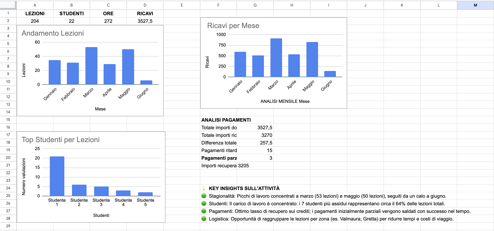
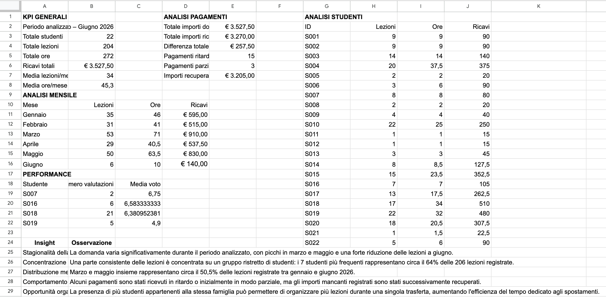

# Private Tutoring Management & Analytics

A data-driven project developed to structure, analyze and improve the management of a private tutoring activity.

The project uses real operational data from a private tutoring activity to transform information about students, lessons, payments and academic performance into structured analysis and actionable insights.

---

## 📌 Project Overview

Managing multiple students over time involves more than scheduling lessons.

As the number of students increases, it becomes increasingly important to keep track of:

* lesson frequency and workload
* student activity
* revenue
* payment behavior
* academic performance
* monthly demand patterns
* operational organization

This project was developed as a practical case study to understand how data analysis and digital organization can support the management of a small service-based activity.

The project covers the period **January–June 2026**.

---

## 🎯 Objectives

The main objectives of the project were to:

* Structure previously scattered tutoring data into a consistent dataset
* Monitor lessons, hours and revenue
* Analyze workload and demand over time
* Track payment behavior
* Record available academic performance data
* Identify recurring operational patterns
* Extract actionable insights for future planning
* Create a visual dashboard for monitoring the activity

---

## 🗂️ Data Structure

The project is organized into several interconnected areas:

### Students

Contains information about the students, including:

* Student ID
* Education level
* Subject
* Hourly rate
* Lesson modality
* Area
* Status
* Family/client grouping

### Lessons

Records individual tutoring sessions, including:

* Lesson date
* Student
* Duration
* Lesson modality
* Hourly rate
* Revenue
* Location/area

### Payments

Tracks:

* Amount due
* Amount received
* Payment date
* Differences between expected and received amounts
* Payment delays
* Partial payments
* Recovered amounts

### Performance

Contains available academic performance data, including:

* Student
* Assessment type
* Grade
* Notes

Only real and available grades were included.

---

## 📊 Analysis

The analysis was designed around several key areas.

### General KPIs

For the January–June 2026 period:

| KPI                   |     Value |
| --------------------- | --------: |
| Students              |        22 |
| Lessons               |       204 |
| Total hours           |       272 |
| Total revenue         | €3,527.50 |
| Average lessons/month |        34 |
| Average hours/month   |      45.3 |

### Monthly Activity

| Month    | Lessons | Hours | Revenue |
| -------- | ------: | ----: | ------: |
| January  |      35 |    46 |    €595 |
| February |      31 |    41 |    €515 |
| March    |      53 |    71 |    €910 |
| April    |      29 |  40.5 | €537.50 |
| May      |      50 |  63.5 |    €830 |
| June     |       6 |    10 |    €140 |

The data show significant variation in activity across the analyzed period, with March and May representing the highest-demand months.

---

## 🔎 Key Insights

### 1. Demand seasonality

Tutoring activity varies considerably throughout the analyzed period, with peaks in **March and May** and a substantial reduction in June.

### 2. Student concentration

The activity is concentrated among a relatively small group of students.

The seven students with the highest number of lessons account for approximately **62.7% of all recorded lessons**.

### 3. Monthly concentration

March and May together account for approximately **50.5% of all lessons** recorded between January and June 2026.

This highlights the importance of planning availability and workload around high-demand periods.

### 4. Payment behavior

The payment analysis identified instances of delayed and partial payments. Some missing amounts were subsequently recovered, while payment tracking also highlighted outstanding differences during the analyzed period.

### 5. Operational efficiency

Students belonging to the same family can create opportunities to organize multiple lessons during the same visit, potentially reducing the relative impact of travel time and improving scheduling efficiency.

---

## 💡 Process Improvement Opportunities

The analysis suggests several opportunities for improving the tutoring activity:

* Plan availability in advance for high-demand periods
* Monitor workload and student frequency on a monthly basis
* Maintain structured payment tracking
* Use online lessons when appropriate to increase scheduling flexibility
* Group lessons strategically when multiple students belong to the same family
* Continue monitoring student performance alongside lesson frequency

These improvements can support more efficient planning while maintaining flexibility for students and families.

---

## 📈 Dashboard

The project includes a dashboard designed to provide a concise overview of the tutoring activity.

The dashboard focuses on:

* Key performance indicators
* Monthly lesson activity
* Revenue trends
* Student activity
* Payment information
* Key analytical insights



## 🔍 Analysis

The analysis section provides a detailed view of the operational data collected during the project, covering monthly activity, student workload, revenue, payment behavior and available performance data.



---

## 🛠️ Tools & Technologies

* **Google Sheets** — data organization, formulas, analysis and dashboard
* **Google Drive** — document and data organization
* **Spreadsheet data analysis** — KPI calculation, aggregation and trend analysis
* **Data visualization** — charts and dashboard design

---

## 🔄 Project Workflow

The project follows a simple data-to-insight workflow:

```text
Raw Tutoring Activity
        ↓
Data Collection
        ↓
Data Structuring
        ↓
Data Cleaning & Organization
        ↓
Analysis
        ↓
Key Insights
        ↓
Process Improvement Opportunities
        ↓
Dashboard
```

---

## 🚀 Future Improvements

Possible future developments include:

* Automating data collection and lesson registration
* Integrating Google Calendar for scheduling
* Introducing automated payment tracking
* Expanding performance analysis
* Adding online/in-person efficiency metrics
* Developing a dedicated tutoring management application
* Connecting the data to Power BI for more advanced reporting
* Adding predictive analysis for workload and demand planning

---

## 📁 Project Structure

```text
private-tutoring-management-analytics/
│
├── README.md
│
├── dashboard/
│   └── dashboard.png
│
└── analysis/
    └── analysis.png
```

---

## 📌 Project Context

This project was developed as a personal portfolio project based on a real private tutoring activity.

The purpose was to apply data organization, analysis and process improvement principles to a real-world operational problem and explore how digital tools can support small service-based businesses.
